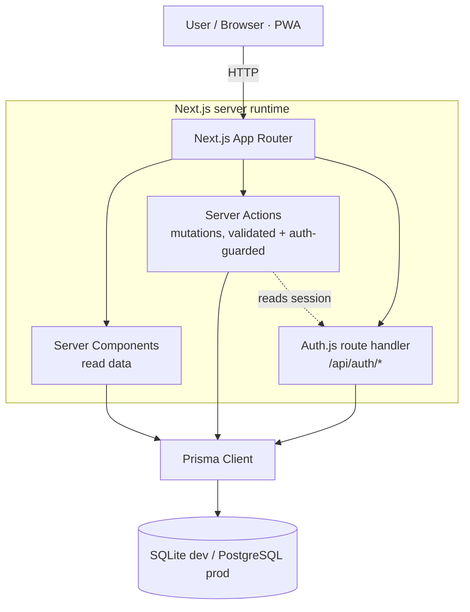
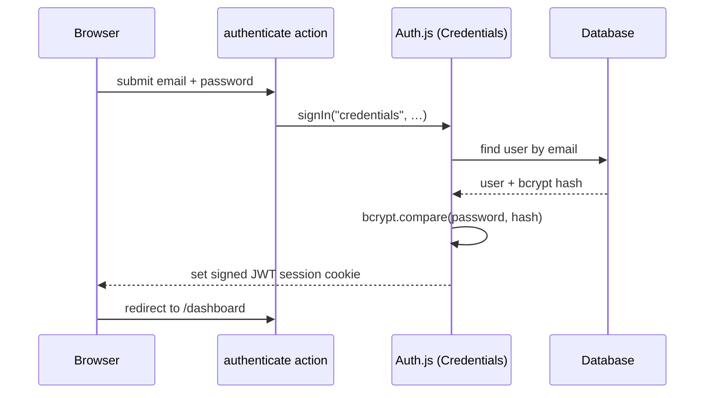
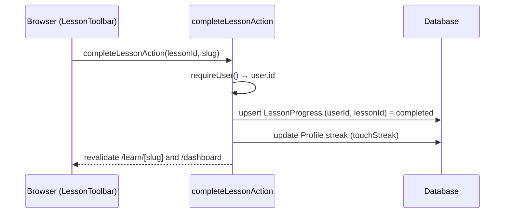
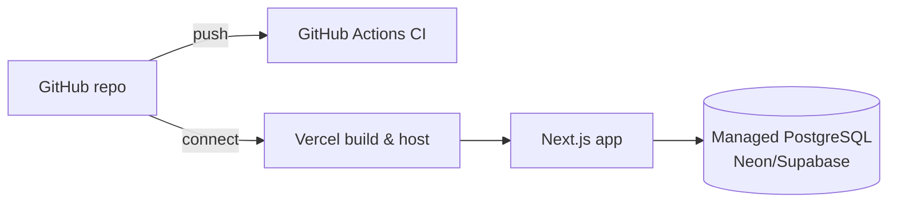

# Architecture

## Overview

AnatomyPath is a single Next.js 15 (App Router) application written in TypeScript. It renders mostly
on the server (React Server Components), uses **server actions** for all mutations, and talks to a
relational database through Prisma. There is no separate backend service — the "backend" is the set of
server components, server actions, and the Auth.js route handler that run in the Next.js server
runtime.



## Frontend responsibilities

- **Server Components** (default) fetch data directly via Prisma and render HTML. Pages like the
  dashboard, lesson, muscle, and exercise pages are server components.
- **Client Components** (`"use client"`) handle interactivity only: the quiz runner, theme toggle,
  nav menu, forms (`useActionState`), and the lesson/bookmark/note toolbars. They call server actions
  for any data change.
- Styling is Tailwind with CSS-variable design tokens (`src/app/globals.css`) so light/dark themes
  switch by toggling a class on `<html>` — set before paint by an inline script to avoid a flash.

## Backend responsibilities

- **Server actions** (`src/lib/actions/*`) are the write API. Each one validates input with Zod,
  resolves the current user via `src/lib/session.ts`, scopes every query by `userId`, and calls
  `revalidatePath` where needed. Quiz correctness is computed **on the server** from stored options.
- **Prisma** is the single data-access layer (`src/lib/db.ts` exports a singleton client).
- **Auth.js** issues and verifies JWT sessions; the `/api/auth/[...nextauth]` route provides its
  endpoints.

## Authentication flow



Sessions are JWTs (no server session store needed). The token carries `id` and `role`; pages call
`getCurrentUser()` / `requireUser()` to read or require a session. See
[`authentication-and-security.md`](authentication-and-security.md).

## Lesson-completion flow



## Quiz-attempt flow

```mermaid
sequenceDiagram
  participant B as QuizRunner (client)
  participant SA as submitAnswerAction
  participant DB as Database
  B->>SA: { questionId, selectedOptionId, confidence }
  SA->>DB: load question + options
  SA->>SA: isCorrect = selected.isCorrect (server-decided)
  alt signed in
    SA->>DB: create QuizAttempt (scoped to userId)
    SA->>SA: grade = gradeFromAnswer(); next = schedule() [SM-2]
    SA->>DB: upsert ReviewState (due date, mastery)
  else guest preview
    SA->>SA: skip all writes
  end
  SA-->>B: { isCorrect, explanation, per-option rationales, mastery, next due }
```

## Content-management approach

Content lives in two places that stay in sync:

1. **Version-controlled seed** in `/content` (typed TypeScript) — the portable, reviewable source of
   truth checked into git.
2. **Database** — the seed is imported by `prisma/seed.ts` after `scripts/validate-content.ts` checks
   referential integrity. The app reads content from the DB.

This satisfies "lessons can be reviewed/updated without editing application code": edit `/content`,
re-run `npm run seed`. A future admin UI (Phase 2) will write directly to the same tables. See
[`content-system.md`](content-system.md).

## Citation architecture

Citations are **polymorphic**: a `Citation` row references a `Source` and points at any content entity
via `(entityType, entityId)` (e.g. `("muscle", <id>)`). The same pattern powers `AssetUsage`,
`Bookmark`, and `Note`. Pages fetch citations with `getCitations(entityType, entityId)` and render
them with the `Citations` component. See [`citations-and-sources.md`](citations-and-sources.md).

## Visual-asset architecture

`VisualAsset` stores full licensing metadata; `AssetUsage` links an asset to the content that uses it.
Original SVGs live under `public/anatomy/`. The Image Credits page lists all assets. See
[`visual-assets-and-licenses.md`](visual-assets-and-licenses.md).

## Deployment architecture



Recommended production: **Vercel** for hosting + a managed **PostgreSQL** (Neon/Supabase). Switch
Prisma's `provider` to `postgresql` and set `DATABASE_URL`. See [`deployment.md`](deployment.md).

## Important tradeoffs

- **SQLite in dev, Postgres in prod** — zero-setup local onboarding at the cost of a provider switch
  for production (ADR 002). The schema avoids DB features that don't port (enums, scalar lists).
- **JWT credentials auth** — no external auth service or email provider needed for the MVP; email
  verification and OAuth are deferred (ADR 003).
- **Custom minimal Markdown renderer** — avoids a heavy dependency and escapes HTML for safety, at the
  cost of supporting only a subset of Markdown.
- **Seed-file content** instead of an admin UI first — gets real, reviewable content in fast; admin UI
  is Phase 2.

## Known limitations & future improvements

See [`roadmap.md`](roadmap.md). Highlights: interactive body map, more body regions, flashcard spaced
repetition, timed practice exams, an admin editing UI, expert content review, and object storage for
uploaded images.
