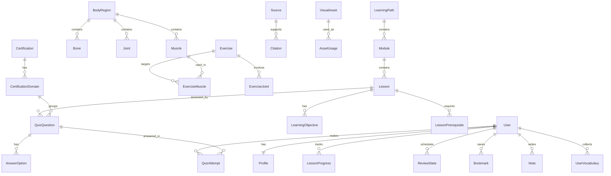

# Database Schema

The schema is defined in [`prisma/schema.prisma`](../prisma/schema.prisma). Provider is **SQLite** for
local dev and is designed to port to **PostgreSQL** in production (see ADR 002). Because SQLite has no
native enums or scalar lists, enum-like fields are `String` (validated in `src/lib/enums.ts`) and lists
are JSON strings or explicit join tables — all of which port cleanly to Postgres.

## Entity-relationship overview



## Key models

| Model | Purpose | Notable fields / relations |
|---|---|---|
| `User` | Account & role | `email` (unique), `passwordHash`, `role` (`learner`/`editor`/`admin`) |
| `Profile` | Per-user prefs & streak | `learningLevel`, `preferredDifficulty`, `theme`, `accessibility` (JSON), `currentStreak` |
| `LearningPath` → `Module` → `Lesson` | Curriculum tree | ordered; `Lesson.status` review state |
| `LearningObjective`, `LessonPrerequisite` | Lesson metadata | prerequisites are self-relations on `Lesson` |
| `BodyRegion`, `Bone`, `Joint`, `Muscle`, `Movement` | Anatomy | `Muscle` holds origin/insertion/actions/innervation + beginner/advanced text |
| `Exercise` + `ExerciseMuscle`/`ExerciseJoint`/`ExerciseMovement` | Exercise library | `ExerciseMuscle.role` = `primary`/`secondary`/`stabilizer` |
| `QuizQuestion` + `AnswerOption` | Quizzes | `AnswerOption.isCorrect` (never sent to client pre-answer) |
| `QuizAttempt` | Per-user answer history | `isCorrect`, `confidence`, `firstAttempt` |
| `LessonProgress` | Per-user lesson state | unique `(userId, lessonId)` |
| `ReviewState` | Spaced repetition | generic `(userId, itemType, itemId)`; SM-2 fields + `masteryLevel` |
| `Bookmark`, `Note`, `UserVocabulary`, `Flashcard`, `VocabularyTerm` | Personalization & language help | polymorphic `(entityType, entityId)` for bookmark/note |
| `Source`, `Citation` | Evidence layer | `Citation` is polymorphic `(entityType, entityId)` → `Source` |
| `VisualAsset`, `AssetUsage` | Images + licensing | full license metadata; usage links to content |
| `Certification`, `CertificationDomain`, `PracticeExam`, `ExamAttempt` | Cert prep | questions link to a domain |
| `ContentReview` | Editorial audit trail | `(entityType, entityId)`, `status`, `reviewer` |

## Indexes & constraints

- Unique constraints enforce data integrity and isolation: `User.email`; `LessonProgress (userId,
  lessonId)`; `ReviewState (userId, itemType, itemId)`; `Bookmark (userId, entityType, entityId)`;
  `UserVocabulary (userId, termId)`; `ExerciseMuscle (exerciseId, muscleId, role)`; slugs on content
  models.
- Indexes exist on foreign keys and on polymorphic `(entityType, entityId)` lookups (citations, asset
  usages, notes) and on `ReviewState (userId, dueDate)` for the review queue.

## User-data isolation rules

Every read or write of user-owned data (`LessonProgress`, `QuizAttempt`, `ReviewState`, `Bookmark`,
`Note`, `UserVocabulary`, `Profile`, `ExamAttempt`) is **always scoped by `userId`**, taken from the
authenticated session — never from client input. Server actions call `requireUser()` first. This is
covered by tests in `tests/integration.test.ts` ("user-data isolation").

## Deletion behavior

Relations use `onDelete: Cascade` for owned children (deleting a `User` removes their profile,
progress, attempts, review states, bookmarks, notes, vocabulary) and `onDelete: SetNull` for optional
content links (e.g. a `QuizQuestion.lessonId`). To delete a user and all their personal data:

```ts
await prisma.user.delete({ where: { id } }); // cascades to owned rows
```

## Migrations

Local dev uses `prisma db push` (fast, no migration history) via `npm run setup`. For production and
tracked history, use migrations:

```bash
npm run db:migrate           # prisma migrate dev — create + apply a migration locally
npx prisma migrate deploy    # apply committed migrations in production
```

Commit the generated `prisma/migrations/` folder when you adopt migrations (recommended before the
first production deploy). See [`deployment.md`](deployment.md).

## Seed data

`npm run seed` runs `prisma/seed.ts`, which **resets** content tables and demo users, then imports the
validated `/content`. It is for initial setup/demos, not for topping up production user data. See
[`content-system.md`](content-system.md) and [`adding-new-content.md`](adding-new-content.md).

## Adding a record safely (example)

```ts
// Always connect to existing rows by stable slug/id and set a review status.
const region = await prisma.bodyRegion.findUnique({ where: { slug: "shoulder" } });
await prisma.muscle.create({
  data: {
    slug: "serratus-anterior",
    commonName: "Serratus anterior",
    scientificName: "Serratus anterior",
    locationSimple: "Along the side of the rib cage under the arm.",
    actions: "Protracts and upwardly rotates the scapula.",
    beginnerExplanation: "…",
    status: "draft", // start as draft until source-checked
    bodyRegionId: region!.id,
  },
});
```
